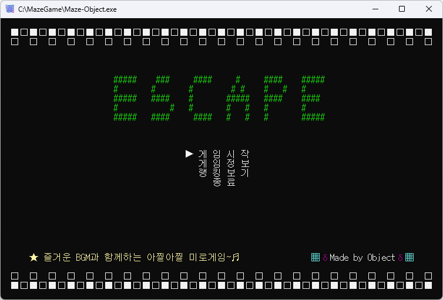
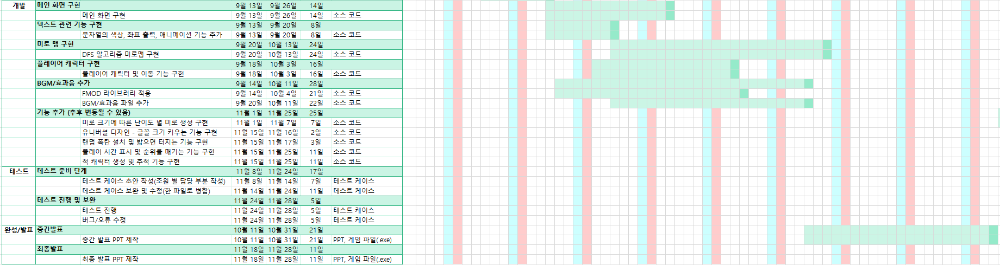

# [C++] ESCAPE - 즐거운 BGM과 함께하는 아찔아찔 미로 게임

 

## 📖 프로젝트 소개
- **팀 이름 :** Object
- **프로젝트명 :** ESCAPE - 즐거운 BGM과 함께하는 아찔아찔 미로 게임
- **프로젝트 기간 :** 2023-08-30 ~ 2023-11-29
- **프로젝트 형태 :** [2학년 2학기 - 객체지향 프로그래밍 2] 전공과목 팀 프로젝트
- **프로젝트 설명**
  - DFS 알고리즘을 통해 생성된 미로를 탈출하는 게임입니다.
  - BFS 알고리즘을 통해 생성된 적이 플레이어를 쫓아오며, 적과 닿으면 게임 오버입니다.
  - 연령대에 따라 유아용, 일반 플레이어용, 노인용 스테이지를 제공합니다.
  - 연령대 스테이지당 두 개의 레벨이 있으며, 높은 레벨은 미로가 조금 더 복잡하게 생성됩니다.
  - FMOD 사운드 라이브러리를 사용하여 미로 게임의 BGM 및 효과음을 재생합니다.

 

## 🗂️ 목차

1. [개발 목표 및 출시 배경](#1-개발-목표-및-출시-배경)
2. [개발 환경](#2-🛠️-개발-환경)
3. [사용 기술 스택](#3-📚-사용-기술-스택)
4. [개발 기간](#4-📆-개발-기간)
5. [개발 중점 사항](#5-🎯-개발-중점-사항)
6. [프로젝트 관련 모든 산출물 목록](#6-📋-프로젝트-관련-모든-산출물-목록)
7. [WBS 및 진척관리](#7-📑-wbs-및-진척관리)
8. [테스트 및 품질관리](#8-📝-테스트-및-품질관리)
9. [협업 및 형상관리](#9-🗃️-협업-및-형상관리)
10. [게임 시연 모습](#10-📸-게임-시연-모습)

 

## 1. 💡 개발 목표 및 출시 배경

- **개발 목표 :** C++ 객체지향의 특성을 최대한 활용하면서, 일반 사용자들 뿐만이 아닌 영유아, 노인분들을 위하여 즐거운 BGM과 함께하는 미로 게임을 개발하는 것입니다.
- **영유아를 위한**
  - 눈과 손을 이용함으로써 소근육 발달을 통해 영유아기의 두뇌 발달을 게임을 이용해 이루어지게 만들어 아이가 보다 흥미를 가질 수 있도록 합니다.
- **노인분들을 위한**
  - 컴퓨터가 낯선 노인분들에게 미로 게임을 통하여 컴퓨터에 대해 조금이나마 친숙함을 드리기 위함입니다.
  - 눈과 손의 협응력을 바탕으로 고도의 집중력을 요구하여 자극에 대한 반응 속도와 시각능력, 공간지각능력, 단기기억능력 등을 향상시켜 치매 완화에 도움을 드리기 위함입니다. 

 

## 2. 🛠️ 개발 환경

- **개발 언어 :** C, C++
- **라이브러리 :** FMOD Sound Library
- **IDE :** Microsoft Visual Studio Community 2022
- **버전 및 형상 관리 :** GitHub Desktop

 

## 3. 📚 사용 기술 스택

- ### C++ (미로 게임 기능 & 적용된 C++ 객체지향 특성)

  | 미로 게임 기능                         | 적용된 C++ 객체지향 특성               |
  |---------------------------------------|--------------------------------------|
  | 메인 화면의 메뉴 선택 기능              | 클래스, 캡슐화, 정보 은닉              |
  | DFS 알고리즘 방식의 미로 생성           | -                                    |
  | 플레이어 이동 기능                      | 상속, 순수 가상 함수, 메서드 오버라이딩 |
  | 문자열 색상, 좌표 출력, 애니메이션 기능  | 다형성, 메서드 오버로딩                |
  | 유니버설 디자인 (미로를 크게 출력)       | -                                    |
  | 폭탄 생성 기능                          | 클래스, 캡슐화, 정보 은닉             |
  | 플레이 시간 측정 & 순위(랭킹) 기능       | 다형성, 연산자 오버로딩               |
  | 적 생성 및 BFS 알고리즘 방식의 추적 기능 | 클래스, 캡슐화, 정보 은닉             |

- ### FMOD Sound Library
  - FMOD 라이브러리를 통한 미로 게임의 BGM 및 효과음 재생
  - GoF 디자인 패턴 : 생성 패턴 - 싱글톤 패턴

 

## 4. 📆 개발 기간

- 프로젝트 기획 : 2023-08-30 ~ 2023-09-06
- 요구사항 분석 : 2023-09-06 ~ 2023-10-08
- 프로젝트 설계 : 2023-09-06 ~ 2023-09-13
- 프로젝트 개발 : 2023-09-13 ~ 2023-11-28
- 테스트 : 2023-11-08 ~ 2023-11-28
- 최종 발표 : 2023-11-29

 

## 5. 🎯 개발 중점 사항

- 다음과 같은 C++ 객체지향의 특성이 최대한 활용되도록 개발하였습니다.
  - 클래스와 객체
  - 캡슐화 및 정보 은닉
  - 상속
    - 순수 가상 함수 (virtual 키워드)
  - 다형성
    - 메서드 오버로딩
    - 메서드 오버라이딩
    - 연산자 오버로딩
- C++의 파일 입출력을 사용하여 게임 스코어 랭킹 기능에 활용하였습니다.
- FMOD 사운드 라이브러리에 싱글톤 패턴이 적용되었습니다.
- 프로젝트를 진행하면서 작성된 계획, 요구사항 분석, 설계, 구현, 테스트 단계의 여러 가지 각종 산출물을 작성하고 관리하도록 하였습니다.
- WBS, 회의록을 통해 체계적인 **진척 관리**가 이루어질 수 있도록 하였습니다.
- 테스트 케이스 및 결함 조치 관련 산출물을 작성하고, 이에 따라 테스트를 진행하여 **품질 관리**를 진행하였습니다.
- GitHub를 통하여 팀원 간의 협업 및 소스 코드의 버전을 관리하고, 각종 산출물 파일도 디렉토리별로 버전을 관리하여 체계적인 **형상 관리**를 진행하였습니다.
- 개발 과정에서 어려움 또는 오류가 발생할 시 팀원 간 서로 **협력하여 해결**하는 과정을 가질 수 있도록 하였습니다.

 

## 6. 📋 프로젝트 관련 모든 산출물 목록

- 일정계획(안) 및 프로젝트 프로파일
- 프로젝트 개발 계획서
- 요구분석 명세서
- 유스케이스 명세서
- 아키텍처 설계서
- WBS (일정계획표)
- 테스트 케이스 및 결함 조치 관리서
- 회의록

> [!IMPORTANT]
> 위의 각종 산출물에 대한 추가적인/자세한 내용은 포트폴리오 문서를 참고 부탁드립니다.

> [!NOTE]
> 본 README.md 내용에서는 특정 산출물의 일부 사진만 첨부되어 있습니다.

 

## 7. 📑 WBS 및 진척관리

- 다음과 같이 WBS를 작성하여 프로젝트의 전반적인 개발 일정을 관리하였습니다.
- 정기적으로 회의를 진행하여 진척 사항을 공유 및 피드백하고, 개발 과정의 이슈 등에 대해 논의하며 **진척 관리**를 진행해 왔습니다.

 

## 8. 📝 테스트 및 품질관리

- **테스트 케이스 :** 본 미로 게임의 전반적인 기능 등을 점검하기 위한 테스트 케이스를 작성하였습니다.
- **결함 조치 관리서** 테스트를 진행하여 테스트 케이스 항목별로 P/NP 여부를 확인하고, 발견된 오류/결함을 어떻게 해결하였는지에 대하여 자세하게 기록하여 **품질 관리**를 진행하였습니다.

 

## 9. 🗃️ 협업 및 형상관리

- **GitHub를 통한 협업 :** 팀원마다 개발 및 작업한 소스 코드를 본 GitHub 저장소에서 Pull Request 생성하고, 팀장이 검토 및 승인 후 Merge(병합)하는 방식으로 협업을 진행하였습니다.
- **형상 관리 :** 소스 코드의 버전 관리는 GitHub를 통하여 관리해왔으며, 각종 산출물 파일도 디렉토리별로 버전을 관리하여 체계적인 **형상 관리**를 진행하였습니다.

 

## 10. 📸 게임 시연 모습

<table>
  <tr>
    <td align="center">
       
      메인 화면
    </td>
    <td align="center">
       
      게임 정보 화면
    </td>
  </tr>
  <tr>
    <td align="center">
       
      스테이지 선택 메뉴
    </td>
    <td align="center">
       
      게임 진행 화면 (일반 플레이어용 스테이지 Level 2)
    </td>
  </tr>
  <tr>
    <td align="center">
       
      순위 랭킹 화면
    </td>
    <td align="center">
       
      노인분들을 위한 유니버설 디자인 (확대 기능)
    </td>
  </tr>
  <tr>
    <td align="center">
       
      게임 클리어 화면
    </td>
    <td align="center">
       
      게임 오버 화면
    </td>
  </tr>
</table>
